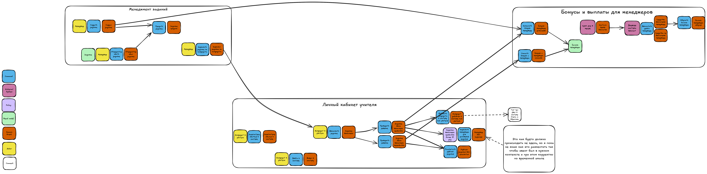

# Как звучит само задание к первому уроку:

- Сделайте EventStorming.  
- Опишите, как после этого изменятся связи: какие из проблем бизнеса (из описанных в списке выше) решатся и почему вы решили изменить существующую связь. Чтобы было проще, воспользуйтесь шаблоном таблицы.

# Решение

Модель ES сделана в Excalidraw — проще открыть её через этот сервис: [файл](./es_homework1.excalidraw)

Также сохранил в формате изображения. Посмотреть [поближе](./es_homework1.png)  

Еще [ссылку](https://excalidraw.com/#json=-OABizp1wT61ewWVyEeLO,dz2jIfy03i3UjJ6V0mWHNA) на excalidraw дам на всякий.

Оказалось, что делать ES достаточно сложно, но и работа с коммуникациями оказалась не легче)))))))
Понимания, как система работает на уровне коммуникаций, не прибавилось даже после составления схемы,
потому что пока непонятно, как менять эти связи, опираясь только на ES.

Подумал, почитал чатик и пришёл к выводу: на данном этапе ES нужен скорее для общего понимания,
как работает система. И если пока не получается связать всё воедино — не стоит упарываться,
а лучше предположить, как могут измениться связи, исходя из общего понимания работы системы,
то есть без жёсткой привязки к ES именно в плане коммуникаций.

Ну или просто пока банально не хватает опыта и знаний, чтобы сделать всё красиво
но как есть. Работаем!

## Таблица с коммуникациями
| Номер связи | Как связь сделана на текущий момент | Зачем нужна | Какая теперь будет связь | Номера проблем бизнеса, которые потенциально решатся | Почему связь необходимо изменить |
|-------------|--------------------------------------|-------------|---------------------------|-------------------------------------------------------|----------------------------------|
| [COMM-010] | HTTP-вызов из сервиса найма в сервис менеджмента заданий | Получить информацию о менеджерах | Асинхронное событие о том, что задание было выполнено правильно и нужно начислить менеджеру бонусы | 040, 070 | По идее эта связь вообще не нужна, потому что мы продьюсим событие о том, что задание было выполнено правильно и нужно начислить менеджеру бонусы. Мы в рамках этого же события даем информацию о менеджере, и сервис бонусов сам изменяет бонусный счёт нужному менеджеру |
| [COMM-020] | HTTP-вызов из сервиса найма в сервис менеджмента. Каждый раз, когда нужно получить информацию об уроке | Получать информацию о задании, чтобы использовать его в бизнес-логике сервиса найма.   **UPDATED:** задание запрашивается каждый раз по-новому. Причём сервис найма получает уже назначенные задания | Пока не знаю | Пока не знаю | Пока не знаю |
| [COMM-030] | HTTP-вызов из сервиса найма в сервис менеджмента. Каждый раз, когда задание выполнили правильно 10 раз подряд | Запустить процесс поиска менеджера, который переделает слишком лёгкое задание | Асинхронная отправка события, что задание выполнили более 10 раз подряд, из ЛК в менеджмент заданий | 010, 020 | Вместо синхронного вызова на назначение менеджера мы продьюсим событие, что задание выполнили правильно более 10 раз (с информацией о задании), и в сервисе менеджмента заданий назначается менеджер |
| [COMM-040] | HTTP-вызов из сервиса найма в сервис бонусов | Списывать бонусы со счёта менеджера, чьё задание неправильно выполнил кандидат | Событие о неправильном выполнении задания, сервис бонусов обработает его и определит, у кого и сколько списать (с учётом рейтинга) | 010?, 040, 070?, 030 | Не нужно делать прямой вызов, если реализовать через события — снижается скрытый coupling. Бонусы могут сами хранить информацию о начислении/списании по заданиям |
| [COMM-050] | HTTP-вызов из сервиса найма в сервис бонусов | Списывать бонусы со счёта менеджера, чьё задание неправильно выполнил кандидат | Аналогично с COMM-040 | 010?, 040, 070?, 030 | Аналогично с COMM-040, только про списание |
| [COMM-060] | Асинхронная отправка события через Kafka из сервиса найма в сервис бонусов  Топик: `task` | Сообщать актуальный рейтинг задания | По идее эта связь не нужна | Пока хз | Информация о рейтинге будет существовать в рамках события о выполнении (или невыполнении) задания |
| [COMM-070] | HTTP-вызов из сервиса бонусов в сервис менеджмента заданий | Получить информацию о менеджерах | Эта связь тоже не нужна | 010?, 040, 070?, 030 | Вся информация будет содержаться в событиях выполнения или невыполнения заданий |
| [COMM-080] | HTTP-вызов из сервиса менеджмента заданий в сервис бонусов | Зачислить бонусы менеджеру, создавшему новое задание | Сервис менеджмента заданий отправляет событие о создании задания, система расчётов бонусов сама решает, что с ним делать | 030, 040, 070, 080 | Нет смысла делать запрос "зачислить средства менеджеру", если создаём событие и система сама начисляет |
| [COMM-090] | HTTP-вызов из сервиса найма в сервис менеджмента. Каждый раз, когда нужно назначить задания кандидатам | Получить список кандидатов в учителя | Пока не ясно, можно ли сделать её асинхронной, так как, возможно, можно подождать получения данных | ? | ? |

