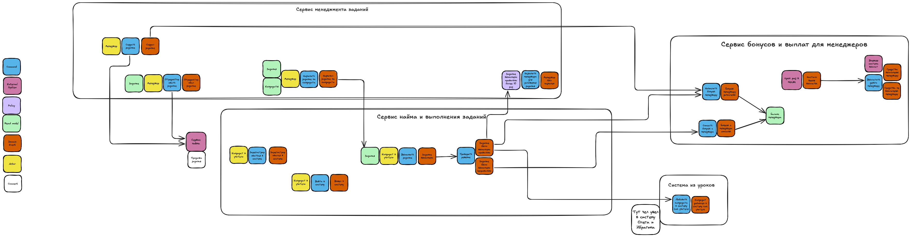
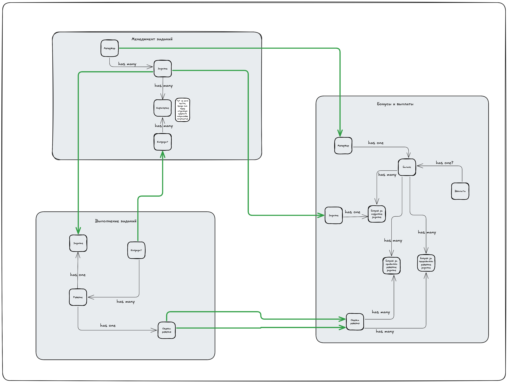

# Как звучит само задание ко второму уроку:

* Сделайте концептуальную модель данных.
* Сделайте общую модель формальных и функциональных связей.
* Найдите места, в которых нужно поменять связи с синхронных на асинхронные. Пока ничего менять не нужно, этим займётесь в следующем уроке.
* Опишите, как после этого изменятся связи. Какие из проблем бизнеса решатся (из описанных в списке выше) и почему вы решили изменить существующую связь. Чтобы было проще, возьмите шаблон таблицы.
* Напишите название всех топиков и события, которые будут в топиках.

# Решение

Обновил [ES](./updated_es_hw1.excalidraw) после разбора ДЗ. Открывать все так же через excalidraw
Также сохранил в формате изображения. Посмотреть [поближе](./updated_es_hw1.png)  

Еще [ссылку](https://excalidraw.com/#json=TID-c82ju1D9MwxRlPsq7,B6PCmhWqcf0_NxchktPeSw) на excalidraw дам на всякий.

## Концепутальная модель данных
Сама модель. Посмотреть [поближе](./data_mode_hm2.png)

Опирался на свою ES модель. Честно говоря в связях и их видах не очень уверен, надеюсь на разбор дз.

Из важного:
* Решил разные бонусы вынести в отдельные сущности, тк за разные мувы начисляются бонусы
* Чтобы отобразить именно назначение задания на кандидата сделал это через отдельную сущность

