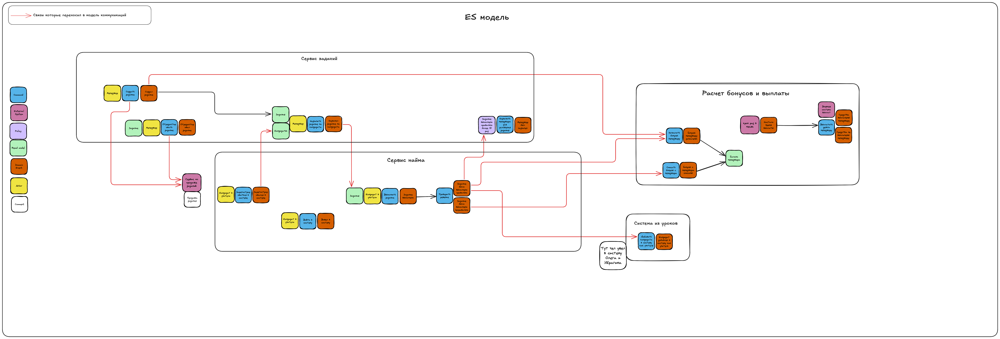
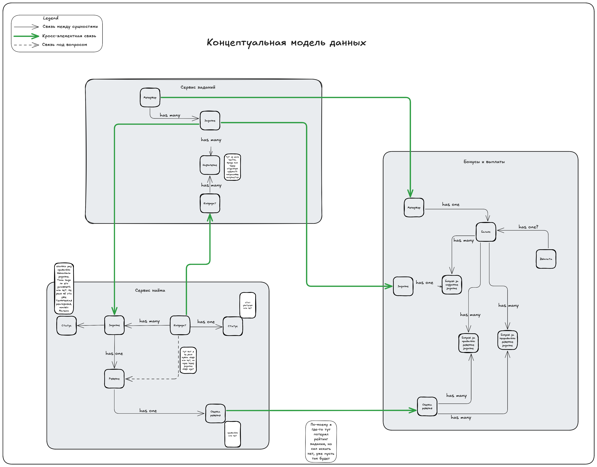
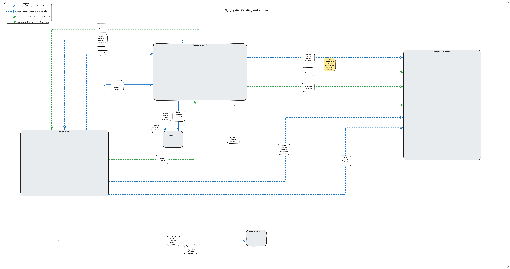

# Как звучит само задание ко второму уроку:

* Сделайте концептуальную модель данных.
* Сделайте общую модель формальных и функциональных связей.
* Найдите места, в которых нужно поменять связи с синхронных на асинхронные. Пока ничего менять не нужно, этим займётесь в следующем уроке.
* Опишите, как после этого изменятся связи. Какие из проблем бизнеса решатся (из описанных в списке выше) и почему вы решили изменить существующую связь. Чтобы было проще, возьмите шаблон таблицы.
* Напишите название всех топиков и события, которые будут в топиках.

# Решение
[Ссылка](https://excalidraw.com/#json=p15B01JHvsBhbuHG1B6yX,MacLRnsVdKHFzW7mHGcb_Q) на доску. Там все модели и ход рассуждений. У меня без ВПН не работает ХЗ

[Файл](./hm2.excalidraw) с доской, открывать через excalidraw. На всякий если ссылка не откроется

Обновил ES после разбора ДЗ.
Посмотреть [поближе](./updated_es_hw2.png)  

## Концепутальная модель данных
Сама модель. Посмотреть [поближе](./data_model_hm2.png)

Опирался на свою ES модель. Честно говоря в связях и их видах не очень уверен, надеюсь на разбор дз.

Из важного:
* Решил разные бонусы вынести в отдельные сущности, тк за разные мувы начисляются бонусы
* Чтобы отобразить именно назначение задания на кандидата сделал это через отдельную сущность

Не уверен в связях и сущностях, но вроде если я прогоняю по ТЗ то вижу все процессы
А еще я по-моему где-то потерял рейтинг, но разбираться сил нету раально

## Модель коммуникаций
Сама модель. Посмотреть [поближе](./communication_model_hm2.png)

Кажется что было не сложно, просто перенес все из модели данныъ и ES модели и прикинул характеристики
системы исходя и проблем, которые возникли

## Таблица с коммуникациями
[Таблица](https://docs.google.com/spreadsheets/d/1oXmpMsXmcy0KGYNXWRf_YFZUhkKzpK1oFt-pIxRNvOs/edit?usp=sharing), лист "связи"

## Таблица с топиками

[Таблица](https://docs.google.com/spreadsheets/d/1oXmpMsXmcy0KGYNXWRf_YFZUhkKzpK1oFt-pIxRNvOs/edit?usp=sharing), лист "топики", жаль но там пусто(( зачтите домашку пж я старался

Не осуждайте друзья. Сил нету реально доделывать, вторую половину воскресенья хоть отдохну.
Уже после разбора ДЗ буду доделывать, ну либо завтра.

## Мой любимый мем и топ фоновая музыка

1. Мой любимый [мем]()
2. Часовая версия [музла](https://www.youtube.com/watch?v=0t6HJZfIMPU) из ведьмака что может быть лучше чем делать что-то сложное
под музыку под КОТОРУЮ УБИВАЛ ВСЕ ЧТО ДВИЖЕТСЯ А ЧТО СТОИТ ДВИГАЛ
