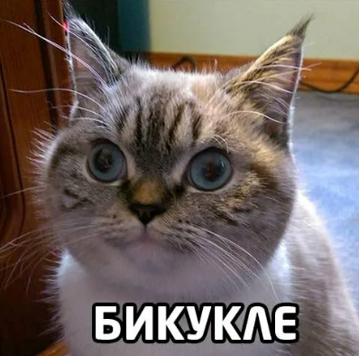
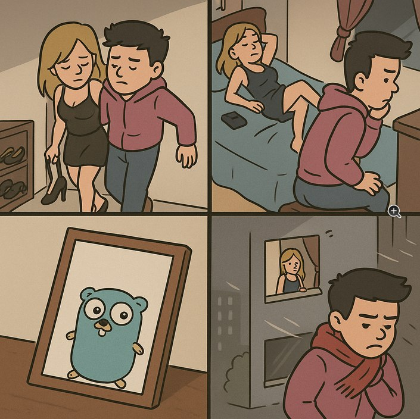
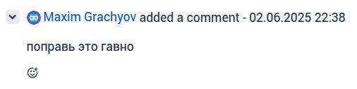
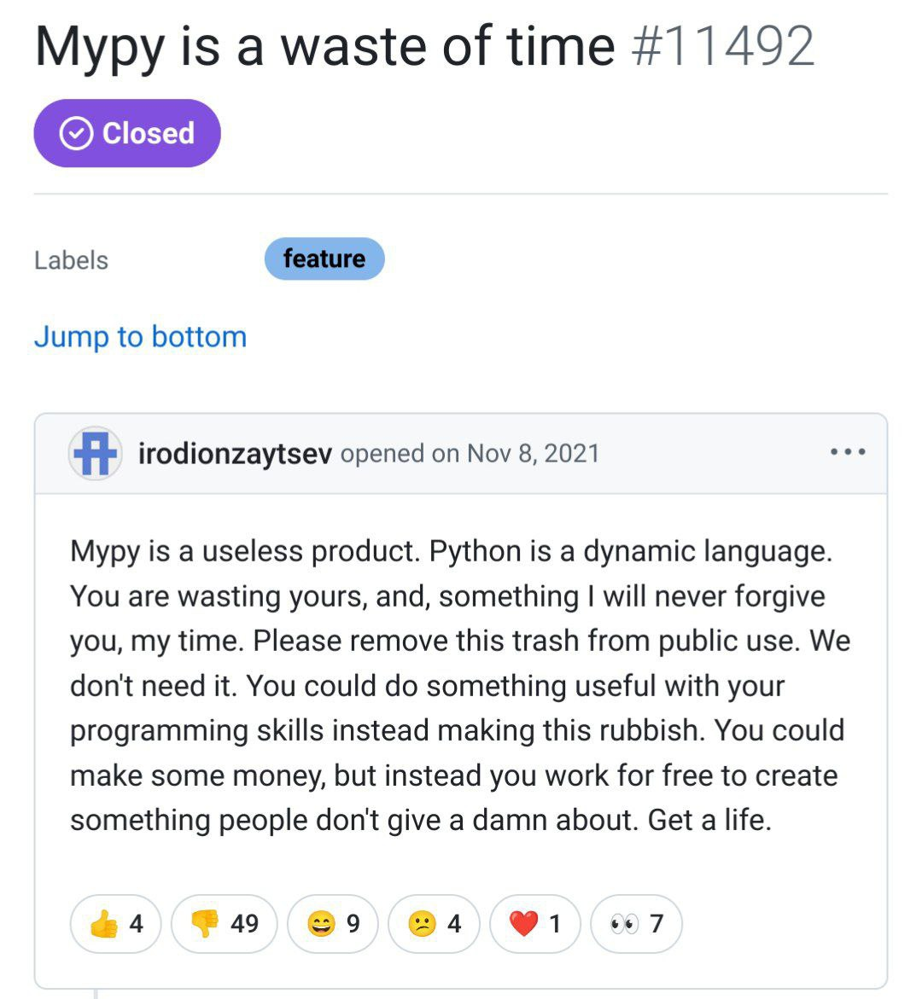

# Как звучит само задание к третьему уроку:
* Опишите ADR, который проиллюстрирует причину изменения любой из коммуникаций. Коммуникацию можно выбрать любую из тех, которые вы мигрировали в третьем уроке.

* Опишите, как почему возникла каждая из 10 проблем, которая возникла у бизнеса и как она будет решаться. Можно заполнить все таблицей

# Решение

Вот [ADR](./001-fix-eventual-consistency-for-created-updated-exercises.md)

Таблица проблем
| Название проблемы | Текст проблемы | Из-за чего возникла проблема | Как проблема решилась |
|-------------------|----------------|-------------------------------|------------------------|
| `[Problem-010]`   | Долго определяется правильность выполнения задания от кандидата. Это вызывает задержки, которые бесят менеджеров и кандидатов в учителя. | Сервису найма плохо из-за большого кол-ва синхронных запросов + много командных коммуникаций с бонусами вместо событийных + сервису заданий тоже не кайф, они постоянно заебывают друг друга синхронными блокирующими запросами                               | Разгружаем сервис найма через переход на асинхронные и реакционные коммуникации и в итоге все кайф                       |
| `[Problem-020]`   | Кандидаты в учителя читерят систему в месте, где простое задание должно усложниться, но этого ещё не произошло. Для этого они собираются в группы, где делятся лёгкими заданиями между собой, и, пока задание обновляется, пачкой выполняют лёгкие версии. | Найм сам ходит в сервис заданий + из-за большого кол-ва синхронных коммуникаций сервис заданий загибается                              | Во первых задания стримятся из сервиса заданий в найм (при назначении на кандидата, логично же), во вторых у нас две коммуникации: стримим созданные задания асинхронно (нет требований по strong consistancy), а обновленные задания стримим отдельно и async event-driven (чтобы не читерили и успевало обновляться)                       |
| `[Problem-030]`   | Логика начисления бонусов некорректна из-за ошибки с рейтингом задания. Во время начисления бонусов во время изменения рейтинга, происходит задержка, которая не удовлетворяет бизнес (нужно моментально). | Все из-за асинхронного события TaskRating.                               |  Тут нужна strong consistancy, поэтому переделываем эту коммуникацию на синхронный стриминг актуального рейтинга из найма в бонусы                       |
| `[Problem-040]`   | Медленно начисляются бонусы менеджерам, потому что много кандидатов в учителя. Иногда вся система падает и не восстанавливается. | Каплинг родненький + блокирующие синхронные коммуникации                              | Все то же что в problem-10                       |
| `[Problem-050]`   | В UI может отобразиться ошибка каких-то запросов после успешного выполнения задания. Разработчики объясняют это поведение вызовом сервиса оплаты и создания заданий. | Я так понимаю тут проблема из-за того, что успешно выполняется старая версия задания, потому что оно не успело обновиться после изменения + неактуальности рейтинга?                     | Решение из Problem-020                               | Я так понимаю тут проблема из-за того, что успешно выполняется старая версия задания, потому что оно не успело обновиться после изменения + неактуальности рейтинга?                     | Решение из Problem-020 
| `[Problem-060]`   | Нужно сократить расходы на скейлинг сервиса заданий. Сейчас дорого. | Много лишних синхронных коммуникаций + сервисов бонусов зачем-то тоже ходит в сервис заданий                             | Сервис заданий сам стримит данные и бизнес события асинхронно, кроме отправки заданий во внешнюю систему продажи +  и обновленного задания в сервис найма. Сервис бонусов перестает обращаться к сервису заданий, потому что будут асинхронно уходить ивенты в сервис бонусов, а он там пусть сам разбирается (снизим лишний coupling)                      |
| `[Problem-070]`   | Менеджерам иногда начисляются бонусы дважды. Это связано с тем, что, когда кандидаты в учителя отправляют то же самое задание повторно, система тупит [Problem-050]. Разработчики объясняют тем, что управление заданиями падает, а бонусами — нет. Из-за этого бонусы попадают в два одинаковых запроса. |  Опять лишние связи                              | Мы отвязали бонусы от всего, на сервис заданий в целом насрать, сервис бонусов сам все начисляет. Единственное это актуальность рейтинга не гаранитруется по идее если сервис заданий ляжет, но не должен                        |
| `[Problem-080]`   | Упавший сервис создания заданий или бонусов кладёт всю систему, и кандидаты в учителя не могут выполнять задания. | Coupling coupling coupling                              | Сервис бонусов мы от всего отвязываем, просто отправляем ему асинхронные ивенты и он сам разбирается. Сервис создания заданий тоже считай отвязался, потому что к нему никто ни за чем не обращается, он сам раскидывает всю нужную информацию, поэтому теперь если сервис заданий отвалится то максимум это кандидат не получит задание, потому что на него не получится его назначить. Ну а с актуальностью бонусов за созданное задание не будет проблем тк задание создать не получится                       |
| `[Problem-090]`   | Фичи выходят слишком медленно. Это связано с тем, что для выполнения любой фичи нужно изучить всю систему и проверить, что ничего не упало. Короче, разработчики сами не понимают, как работает система вне отдельного сервиса. | Документации нет, схема коммуникаций - залупа, каплинга - пиздец                              | Спасут es модель, data model и communication model + нормальный нейминг + наличие adr чтобы было понятно что вообще происходит. Плюс переделка коммуникация которе пофиксят coupling                      |
| `[Problem-100]`   | Данные теряются вокруг логики выполнения заданий кандидатами в учителя. |  Тут я чет все еще хз откуда проблема                             | Так ну тут по идее поможет настроенный мониторинг, потом если события это проверка их на coarse/fine, + стратегии из урока 3.3 + возможно раз данные теряются это корректная async->sync                       |

